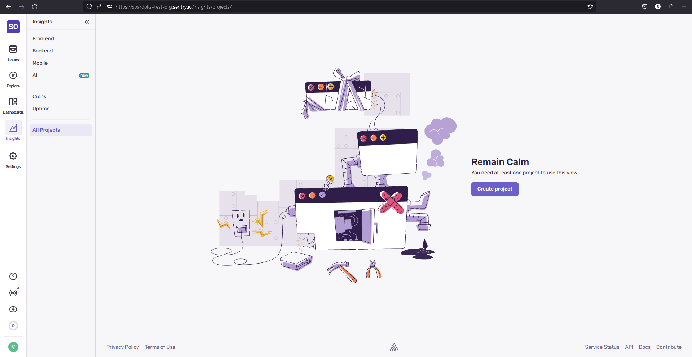
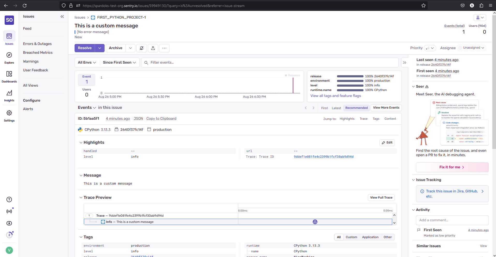
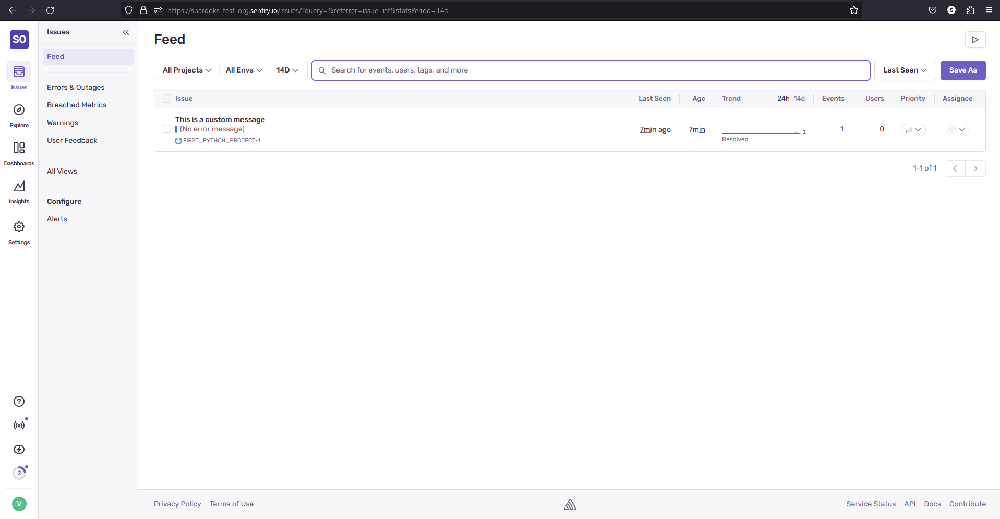
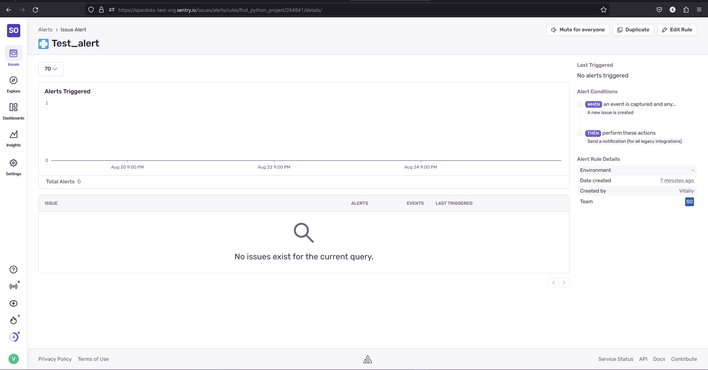
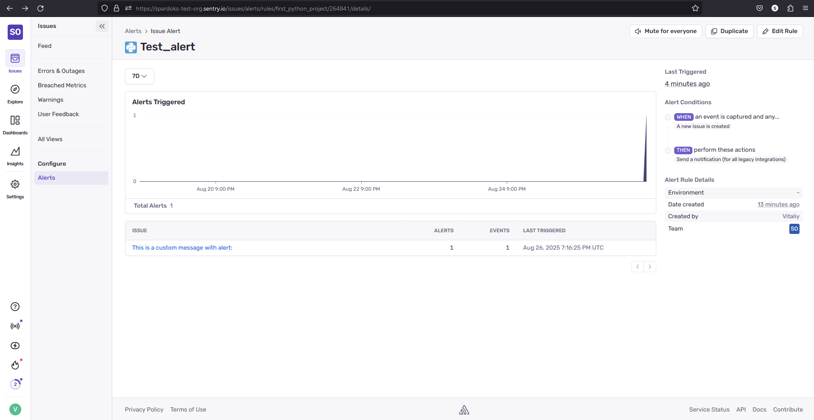

# Домашнее задание к занятию «Платформа мониторинга Sentry»

https://github.com/netology-code/mnt-homeworks/blob/MNT-video/10-monitoring-05-sentry/README.md

## Задание 1

Так как Self-Hosted Sentry довольно требовательная к ресурсам система, мы будем использовать Free Сloud account.

Free Cloud account имеет ограничения:

- 5 000 errors;
- 10 000 transactions;
- 1 GB attachments.

Для подключения Free Cloud account:

- зайдите на sentry.io;
- нажмите «Try for free»;
- используйте авторизацию через ваш GitHub-аккаунт;
- далее следуйте инструкциям.

В качестве решения задания пришлите скриншот меню Projects.

## Задание 2

1. Создайте python-проект и нажмите `Generate sample event` для генерации тестового события.
2. Изучите информацию, представленную в событии.
3. Перейдите в список событий проекта, выберите созданное вами и нажмите `Resolved`.
4. В качестве решения задание предоставьте скриншот `Stack trace` из этого события и список событий проекта после нажатия `Resolved`.

## Задание 3

1. Перейдите в создание правил алёртинга.
2. Выберите проект и создайте дефолтное правило алёртинга без настройки полей.
3. Снова сгенерируйте событие `Generate sample event`.
Если всё было выполнено правильно — через некоторое время вам на почту, привязанную к GitHub-аккаунту, придёт оповещение о произошедшем событии.
4. Если сообщение не пришло — проверьте настройки аккаунта Sentry (например, привязанную почту), что у вас не было 
`sample issue` до того, как вы его сгенерировали, и то, что правило алёртинга выставлено по дефолту (во всех полях all).
Также проверьте проект, в котором вы создаёте событие — возможно алёрт привязан к другому.
5. Дополнительно поэкспериментируйте с правилами алёртинга. Выбирайте разные условия отправки и создавайте sample events. 

## Задание повышенной сложности

1. Создайте проект на ЯП Python или GO (около 10–20 строк), подключите к нему sentry SDK и отправьте несколько тестовых событий.
2. Поэкспериментируйте с различными передаваемыми параметрами, но помните об ограничениях Free учётной записи Cloud Sentry.
3. В качестве решения задания пришлите скриншот меню issues вашего проекта и пример кода подключения sentry sdk/отсылки событий.

---

## Решение 1

Зарегистрировались и перешли в проекты. Пришлось обходными путями...



## Решение 2 (в том числе задание повышенной сложности)

Не удалось после создания проекта найти кнопку `Generate sample event`. Sentry сразу рекомендует использовать sdk для генерации события

[main.py](./main.py)

```
import sentry_sdk

sentry_sdk.init(
    dsn="ТУТ НУЖНО ВСТАВИТЬ ДАННЫЕ ИЗ ПРОФИЛЯ",
    send_default_pii=True,
)

sentry_sdk.capture_message("This is a custom message", level="info")
```
Информация о полученном событии




Информация о всех событиях



## Решение 3

Создаём alert



Активируем alert через [main.py](./main.py)

